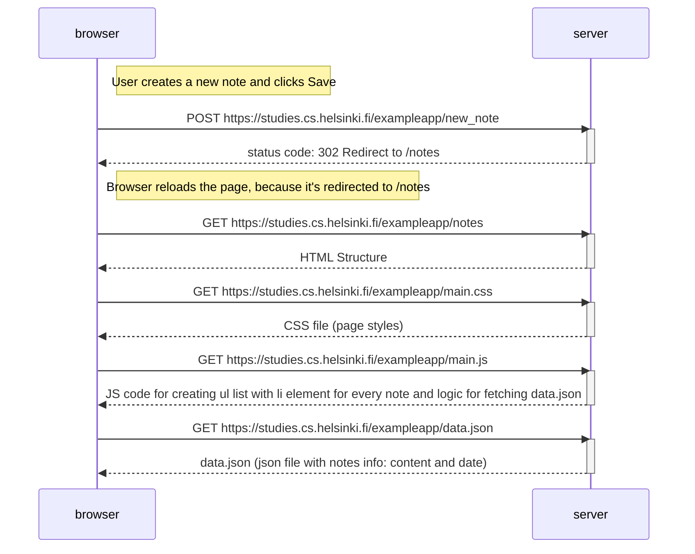

```mermaid
sequenceDiagram
    participant browser
    participant server

    Note right of browser: User creates a new note and clicks Save
    browser->>server: POST https://studies.cs.helsinki.fi/exampleapp/new_note
    activate server
    server-->>browser: status code: 302  Redirect to /notes
    deactivate server
    Note right of browser: Browser reloads the page, because it's redirected to /notes

    browser->>server: GET https://studies.cs.helsinki.fi/exampleapp/notes
    activate server
    server-->>browser: HTML Structure
    deactivate server

    browser->>server: GET https://studies.cs.helsinki.fi/exampleapp/main.css
    activate server
    server-->>browser: CSS file (page styles)
    deactivate server

    browser->>server: GET https://studies.cs.helsinki.fi/exampleapp/main.js
    activate server
    server-->>browser: JS code for creating ul list with li element for every note and logic for fetching data.json
    deactivate server

    browser->>server: GET https://studies.cs.helsinki.fi/exampleapp/data.json
    activate server
    server-->>browser: data.json (json file with notes info: content and date)
    deactivate server
```
