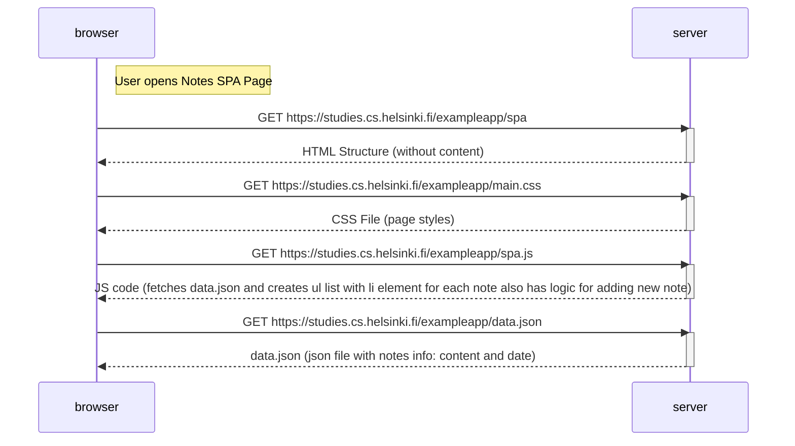

```mermaid
sequenceDiagram
    participant browser
    participant server

    Note right of browser: User opens Notes SPA Page
    browser->>server: GET https://studies.cs.helsinki.fi/exampleapp/spa
    activate server
    server-->>browser: HTML Structure (without content)
    deactivate server

    browser->>server: GET https://studies.cs.helsinki.fi/exampleapp/main.css
    activate server
    server-->>browser: CSS File (page styles)
    deactivate server

    browser->>server: GET https://studies.cs.helsinki.fi/exampleapp/spa.js
    activate server
    server-->>browser: JS code (fetches data.json and creates ul list with li element for each note also has logic for adding new note)
    deactivate server

    browser->>server: GET https://studies.cs.helsinki.fi/exampleapp/data.json
    activate server
    server-->>browser: data.json (json file with notes info: content and date)
    deactivate server
```
