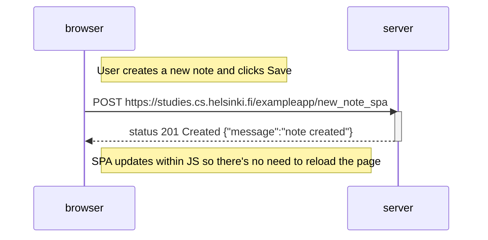

```mermaid
sequenceDiagram
    participant browser
    participant server

    Note right of browser: User creates a new note and clicks Save
    browser->>server: POST https://studies.cs.helsinki.fi/exampleapp/new_note_spa
    activate server
    server-->>browser: status 201 Created {"message":"note created"}
    deactivate server

    Note right of browser: SPA updates within JS so there's no need to reload the page
```
